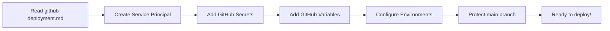

# 🎯 Developer Setup Guide - Overview

Welcome to Secret Santa! This guide helps you choose the right documentation for your needs.

## 📚 Documentation Roadmap

### ☁️ For Cloud Development (Recommended for Beginners)

**Start here:** [codespaces-setup.md](codespaces-setup.md)

- ✅ **30-Second Quick Start** - No installation needed
- ✅ **Browser-Based Development** - Everything in VS Code web
- ✅ **Full-Stack Debugging** - F5 works same as local
- ✅ **Docker-in-Docker** - Containers run inside Codespace
- ✅ **Performance Tips** - How to make Codespaces faster
- ✅ **Troubleshooting** - Common Codespaces issues

**What you'll do:**
```bash
# 1. Click Codespaces badge in README
# 2. Wait 60 seconds for container to build
# 3. Press F5 in browser-based VS Code
# 4. Click notification to open frontend
```

**Perfect for:**
- ✅ Trial/learning the app
- ✅ Quick bug fixes
- ✅ Reviewing PRs
- ✅ No local setup required
- ✅ Works on any device with a browser

---

### 🚀 For Local Development (You're starting fresh)

**Start here:** [getting-started.md](getting-started.md)

- ✅ **Quick Start** (5 minutes) - Get running with one debug command
- ✅ **Development Workflow** - Understand file structure and hot reload
- ✅ **Debugging** - VS Code breakpoints for frontend and API
- ✅ **Database Management** - View/reset Cosmos DB locally
- ✅ **Testing** - Unit tests, E2E tests, manual testing
- ✅ **Troubleshooting** - Common issues and solutions

**Deep dive:** [local-development-setup.md](local-development-setup.md) - How local settings are auto-configured

**Key files for local dev:**
- `docker-compose.yml` - Cosmos DB + Azurite containers
- `api/local.settings.json` - Local API configuration (auto-generated)
- `.vscode/launch.json` - VS Code debug configurations
- `.vscode/tasks.json` - Build/run tasks

**What you'll do:**
```bash
docker-compose up -d          # Start Cosmos DB + Azurite
# Open VS Code
F5                            # Start debugging (🚀 Full Stack)
# App opens at http://localhost:5173
```

---

### 🔧 For GitHub CI/CD & Deployment (You're ready to deploy)

**Start here:** [github-deployment.md](github-deployment.md)

- ✅ **Quick Setup** (10 minutes) - Service principal + GitHub secrets
- ✅ **Architecture** - Understand the deployment pipeline
- ✅ **Prerequisites** - What you need before starting
- ✅ **Service Principal** - Secure GitHub ↔ Azure authentication
- ✅ **GitHub Configuration** - Secrets, variables, environments
- ✅ **Workflow Overview** - How CI/CD actually runs
- ✅ **Environments** - PR preview, QA, Production
- ✅ **Best Practices** - Branch strategy, commit messages, security
- ✅ **Troubleshooting** - Debug failing workflows

**Key files for CI/CD:**
- `.github/workflows/ci-cd.yml` - Complete pipeline automation
- `scripts/deploy.sh` / `deploy.ps1` - Manual deployment scripts
- `infra/parameters.*.json` - Environment-specific configs
- `infra/main.bicep` - Infrastructure as Code template

**What happens automatically:**
```
1. Push to GitHub
   ↓
2. CI/CD runs: Build → Test → Deploy to QA → Test QA
   ↓
3. Manual approval needed
   ↓
4. Auto-deploys to Production
   ↓
5. Status posted to PR/Actions
```

---

## 🎓 Learning Paths

### Path 1: I want to develop in the cloud (easiest)


**Time: 5 minutes (after container builds)**

[📖 Full Codespaces Guide](codespaces-setup.md)

---

### Path 2: I want to develop locally
graph LR
    A["Read getting-started.md"] --> B["Setup Docker Compose"]
    B --> C["Run: docker-compose up -d"]
    C --> D["Press F5 in VS Code"]
    D --> E["Start coding!"]
    E --> F["Run tests: npm run test:e2e"]
```

**Time: 15 minutes**

---

### Path 3: I want to set up CI/CD



**Time: 30 minutes**

---

### Path 4: I want to do all three (first-time contributor)

```
1. Follow Path 1 (Cloud Development - EASIEST START)
   └─ Get app running in Codespaces
   └─ Make a test change
   └─ See hot reload

2. Or follow Path 2 (Local Development - if you prefer your machine)
   └─ Get app running locally
   └─ Make a test change
   └─ Run local tests

3. Push to feature branch
   └─ GitHub creates PR
   └─ CI/CD auto-creates preview environment

4. Review preview URL in PR comment
   └─ Test your changes
   └─ See real infrastructure deployed

5. Merge to main (after approval)
   └─ CI/CD auto-deploys to QA
   └─ QA tests run
   └─ Manual approval needed
   └─ Auto-deploys to production

6. Follow Path 3 (only if you're a maintainer)
   └─ Set up service principal (one-time)
   └─ Configure GitHub secrets
```

**Time: 1-2 hours end-to-end**

---

### Path 3: I want to do both (first-time contributor)

---

## 🔑 Key Concepts

### Local Development ([getting-started.md](getting-started.md))

**What's included locally:**
- ✅ Cosmos DB Emulator (in Docker)
- ✅ Azurite Storage Emulator (in Docker)
- ✅ Azure Functions (locally)
- ✅ Vite dev server (locally)
- ❌ Email (disabled by default)

**Runs at:** `http://localhost:5173`

**Database:** Emulated Cosmos DB, data persists in Docker volume

**Perfect for:** Feature development, debugging, testing

---

### CI/CD Deployment ([github-deployment.md](github-deployment.md))

**What's included in CI/CD:**
- ✅ Automated testing (build, lint, E2E)
- ✅ Automatic PR preview environments
- ✅ QA deployment with full infrastructure
- ✅ Production deployment (with approval)
- ✅ Automatic cleanup on PR close
- ✅ Environment variables auto-configured

**Environments:**
- **PR Environment**: Ephemeral (deleted when PR closes)
- **QA Environment**: Persistent (for testing)
- **Production**: Persistent (live app)

**Costs:** $30-150/month for prod + QA

---

## 📋 Checklists

### ✓ New Developer Checklist

- [ ] Node.js 20+ installed
- [ ] Docker & Docker Compose installed
- [ ] Git configured (`git config user.email/name`)
- [ ] Azure CLI installed (`az --version`)
- [ ] Cloned repository
- [ ] Read [getting-started.md](getting-started.md)
- [ ] Run `docker-compose up -d`
- [ ] Press F5 in VS Code
- [ ] App loads at http://localhost:5173
- [ ] Run `npm run test:e2e` locally
- [ ] Make a test change to see hot reload
- [ ] Create feature branch: `git checkout -b feat/your-feature`
- [ ] Make changes and test locally
- [ ] Commit: `git commit -m "feat: add your feature"`
- [ ] Push: `git push origin feat/your-feature`
- [ ] Create Pull Request on GitHub
- [ ] Wait for CI/CD to run (~10 minutes)
- [ ] Click preview URL in PR comment
- [ ] Test your changes in preview

### ✓ Maintainer/Ops Checklist

- [ ] Azure subscription created
- [ ] Service principal created (see [github-deployment.md](github-deployment.md))
- [ ] GitHub secrets added (`AZURE_CREDENTIALS`)
- [ ] GitHub variables added (`AZURE_RESOURCE_GROUP`, etc.)
- [ ] Production resource group created
- [ ] Initial infrastructure deployed
- [ ] Protected branch rules configured on `main`
- [ ] Required reviewers configured
- [ ] Production environment requires approval
- [ ] Monitoring/alerts configured in Azure
- [ ] Budget alerts configured
- [ ] Team access granted to GitHub + Azure

---

## 🚀 Next Steps

### I'm a Developer

1. **Get Local Setup:**
   - Read [getting-started.md](getting-started.md)
   - Run `docker-compose up -d`
   - Press F5 to debug

2. **Make Your First PR:**
   - Create feature branch
   - Make changes locally
   - Push to GitHub
   - Review preview in PR comment
   - Iterate based on feedback

3. **Get PR Approved & Merged:**
   - Address review comments
   - Merge to `main`
   - Watch it auto-deploy to QA
   - See it reach production after approval

### I'm a DevOps/Maintainer

1. **Set Up CI/CD:**
   - Read [github-deployment.md](github-deployment.md)
   - Create service principal
   - Add GitHub secrets + variables
   - Configure environments
   - Protect `main` branch

2. **Configure Azure:**
   - Create resource groups
   - Deploy initial infrastructure
   - Set up monitoring + alerts
   - Configure budgets

3. **Maintain & Monitor:**
   - Review deployments in GitHub Actions
   - Monitor costs in Azure
   - Update Bicep templates as needed
   - Rotate credentials every 90 days

---

## 📞 Support

### Issues?

1. **Local development problem?**
   - Check [getting-started.md - Troubleshooting](getting-started.md#troubleshooting)
   - Check `docker-compose logs -f`
   - Check VS Code Debug Console

2. **GitHub/Deployment problem?**
   - Check [github-deployment.md - Troubleshooting](github-deployment.md#troubleshooting)
   - Check GitHub Actions logs
   - Check Azure Activity Log

3. **Still stuck?**
   - Create GitHub issue with error message
   - Include your OS and versions (`node --version`, `docker --version`)
   - Include relevant logs

---

## 📖 Full Documentation Map

```
README.md
├── Feature Overview & Screenshots

docs/getting-started.md ← START HERE FOR DEVELOPMENT
├── Prerequisites
├── Quick Start (5 min)
├── Development Workflow
├── Debugging
├── Database Management
├── Testing
├── Troubleshooting
└── Advanced Topics

docs/local-development-setup.md
└── How local.settings.json is auto-configured for all environments
    ├── Automatic Setup Workflow (local, Codespaces, CI/CD, Production)
    ├── File Structure & Security
    ├── Configuration Details
    ├── Setup Scripts
    └── Environment-Specific Behavior

docs/github-deployment.md ← START HERE FOR CI/CD
├── Quick Setup (10 min)
├── Architecture
├── Service Principal Setup
├── GitHub Configuration
├── Workflow Overview
├── Environments
├── Best Practices
├── Troubleshooting
└── Security

docs/architecture.md
└── Technical deep dive (if needed)

docs/api-reference.md
└── API endpoints reference

docs/deployment.md
└── Deployment process (supplemental)

docs/CONTRIBUTING.md
└── How to contribute to the project
```

---

## ⚡ Pro Tips

### For Developers

```bash
# Hot reload works for both frontend and API
# Edit code → auto-save → auto-reload

# Debug with breakpoints
# Add breakpoint → Refresh/Call endpoint → Step through code

# Run E2E tests before pushing
npm run test:e2e:ui  # See tests in browser

# Check your changes against QA environment
# Open preview URL from PR comment
# Test on multiple browsers/devices

# Clean rebuild if weird issues
docker-compose down -v
docker-compose up -d

```

### For DevOps/Maintainers

```bash
# View deployment status
gh run list --workflow ci-cd.yml

# View Azure resources
az group list --output table
az resource list --resource-group secretsanta --output table

# Check costs
az billing invoice list --output table

# Emergency rollback
# Redeploy previous commit via GitHub Actions
# Or manually run: az deployment group create --template-file infra/main.bicep
```

---

**Last Updated:** December 2024

**Version:** 1.0.0

**Maintainers:** @dsanchezcr

---

Ready to get started? 👇

👨‍💻 **Developer?** → [Read getting-started.md](getting-started.md)

🔧 **DevOps?** → [Read github-deployment.md](github-deployment.md)

❓ **Questions?** → [Open an Issue](https://github.com/dsanchezcr/secretsanta/issues)

````

